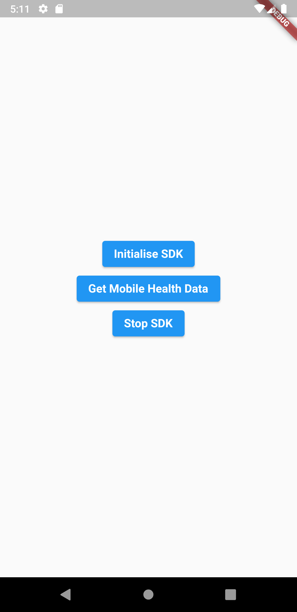

# Sentiance SDK Flutter

Flutter plugin for generating Mobile Health Status.


[](https://sentiance.com/)

# Disclaimer

This is package is only for Android.


- [Sentiance SDK Flutter](#sentiance-sdk-flutter)
- [Disclaimer](#disclaimer)
  - [Getting Started](#getting-started)
  - [Prerequisites](#prerequisites)
  - [Installation](#installation)
  - [Usage](#usage)
      - [Import package](#import-package)
      - [Create Sentiance instance](#create-sentiance-instance)
      - [Properties names](#properties-names)
      - [Get the Mobile Health Data](#get-the-mobile-health-data)
      - [Stop Sentiance](#stop-sentiance)


[](https://sentiance.com/)

## Getting Started

This flutter plugin is a wrapper around our Android SDKs.

The following documentation is only focused on the wrapper around our native Android SDKs. To know more about our SDKs and how to link them within the projects, refer to the following documentation:

**Android**: 

[https://docs.sentiance.com/sdk/changelog/android](https://docs.sentiance.com/sdk/changelog/android)


## Prerequisites

 - Learn about the <a href="https://docs.sentiance.com/sdk/getting-started/android-sdk" target="_blank">Sentiance Android Documentation </a>.
 

## Installation

Fork the repository from url

Go to android/src/res/AndroidManifest.xml and your Geo Location API KEY

      <meta-data
            android:name="com.google.android.geo.API_KEY"
            android:value= "GOOGLE_API_KEY"/>


This plugin is available on Pub: [https://pub.dev/packages/sentiance_flutter](https://pub.dev/packages/sentiance_flutter)

Add this to `dependencies` in your app's `pubspec.yaml`

```yaml
sentiance_flutter:
      git: <Package url>
      branch: master
```

**Note for Android**: Make sure that the minimum API level for your app is 19 or higher.

Run `flutter packages get` in the root directory of your app.

## Usage

Sample code to integrate can be found in [example/lib/main.dart](example/lib/main.dart).

#### Import package 

```dart
import 'package:sentiance_flutter/sentiance_flutter.dart';
```

#### Create Sentiance instance

```dart
await SentianceFlutter.initialiseSentiance();          
```


#### Properties names

The Properties names which are used in the `initialiseSentiance` Method.

| Properties Name       | Description                                                 |
| --------------------- | ----------------------------------------------------------- |
| token                 | A unique identifier for your sentiance account.             |
| sentianceSecret       | A secret key generated by Sentiance unique to your account. |
| appId                 | Unique identifier for each device.                          |
| crashDetectionUrl     | Stores information regarding crash.                         |
| mobileHealthUrl       | Stores information regarding Mobile Health.                 |


#### Get the Mobile Health Data 

```dart
await SentianceFlutter.getMobileHealthData
```


#### Stop Sentiance 

```dart
await SentianceFlutter.stopSentianceSDK;
```

